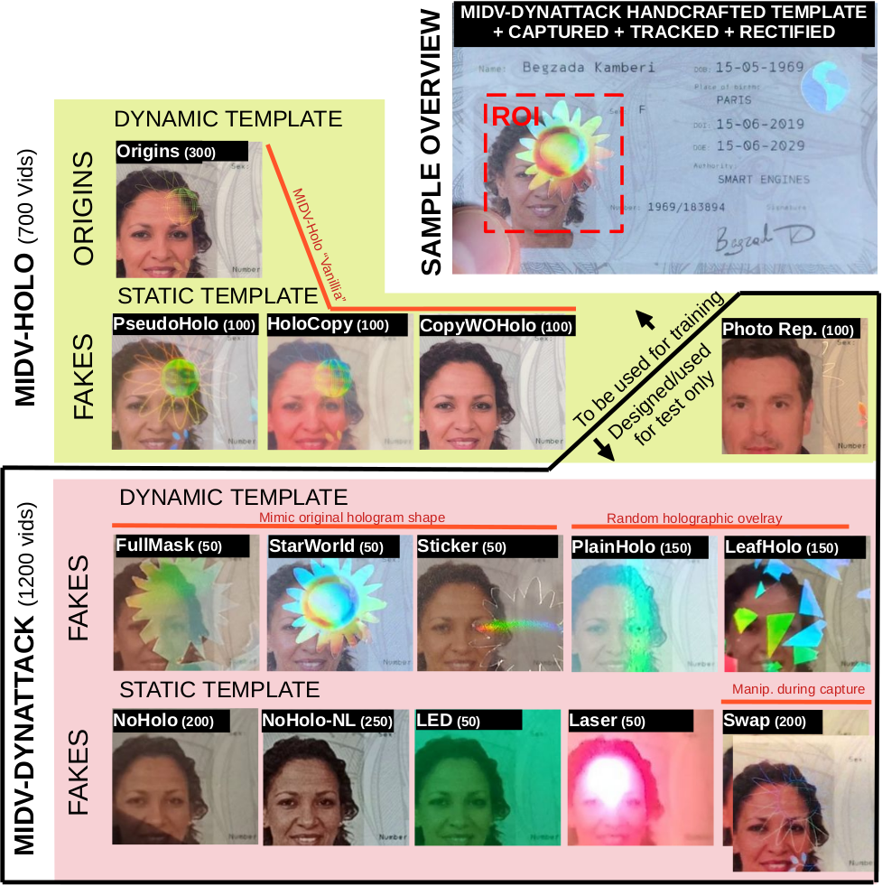

# Verification of Dynamic Holographic Behavior in Identity Documents
Repository for the paper "Verification of Dynamic Holographic Behavior in Identity Documents" submitted to ICDAR 2025.



## How to launch all the xp
After creating a Python3 environment (tested with python 3.9) you can install all requirements with
```bash
pip install -r requirements.txt
```
## Datasets
The experiments use the MIDV-Holo and MIDV-DynAttack datasets containing:
### Source Data:
  - `video`: Captured videos
  - `tracking`: Document localization coordinates for each frame extracted at 15fps

### Derived Data:
  - `images`: Extracted frames from videos at 15 FPS
  - `rectified`: Rectified documents using provided localization information
  - `cropped`: ROIs containing part of the face and main hologram
  - `cropped_sub`: ROIs after preprocessing

Download the `source data` and the `cropped` data from Zenodo at [this link](https://zenodo.org).  

#### Why are we providing Derived Data:
- Ensures reproducibility of the experiments
- Enables easier visualization of the dataset

### Data Processing Pipelines
1. The `images` directory contains frames extracted from videos at 15 FPS using FFmpeg:  
```bash
ffmpeg -i in/vid.mp4 -vf fps=15 -q:v 2 out/img_%04d.jpg
```
2. Document Rectification:  
The `rectified` directory contains geometrically rectified documents using the `tracking` images annotations.
3. ROI Extraction:  
The `cropped` directory contains specific regions of interest (ROIs) extracted from the rectified images,
focusing on the face area and the main hologram.
4. Background Subtraction and Pseudo-Labeling:  
  The `cropped_sub` directory contains preprocessed ROIs:
  - Background subtraction was performed using `jobs/dataset/bg_sub.sh`
  - Pseudo-Labels were generated using `jobs/dataset/pseudolabel.sh`

### Separation between MIDV-Holo and MIDV-DynAttack

MIDV-DynAttack and [MIDV-Holo](https://github.com/SmartEngines/midv-holo) are both present in `data/midvdynattack`.


For each of the subdirectories:

#### MIDV-DynAttack (our proposed dataset)
```bash
# Static templates
fraud/no_holo/               # Template without lamination
fraud/plastified_lowreflect/ # Template with lamination with minimal reflections
fraud/plastified_noholo/     # Template with lamination with deliberate reflections from multiple light sources
fraud/laser/                 # Template with lamination, red laser moving over the document.
fraud/plastified_led/        # Template with lamination, samples illuminated with multi-color LED-light rings
fraud/swap/                  # Templates without lamination, swapping between two printed documents
fraud/swap_three/            # Templates without lamination, swapping between three printed documents

# Dynamic templates
fraud/plain_holo/            # Homogeneous holographic material displaying continuous diffraction patterns.
fraud/leaf_holo/             # Material exhibiting distinctive polygonal light patterns, shaped as leaves.
fraud/double_sticker/        # Combination of a flower-shaped element cut from laser holographic film and a “genuine” sticker
fraud/holo_star_world/       # Combination of a main flower shape and a world-like hologram pattern.
fraud/holo_completemask/     # Rough mask of the hologram applied over the entire printed document.
```

#### MIDV-Holo
```bash
origins/
fraud/photo_holo_copy/
fraud/pseudo_holo_copy/
fraud/copy_without_holo/
fraud/photo_replacement/
```
Note: the videos of MIDV-Holo are not present in the `video` repository (only those of MIDV-DynAttack).  

### Main Experiments at 5fps


- **MIDVHolo Approach**:
  - `jobs/midvholo/calibrate_midvholo_5fps.sh`: Calibrate MIDVHolo method

- **Weakly Supervised Learning**:
  - `jobs/wsl/train_wsl_5fps.sh`: Train WSL method

- **Direct Classifier**:
  - `jobs/direct_classifier/train_mobilevit_5fps.sh`: Train classifier
  - `jobs/direct_classifier/train_mobilevit_5fps_sub.sh`: Train classifier on preprocessed ROIs

- **Our Proposed Method (HoloVerif)**:
  - `jobs/holo_verif/train_mobilevit_5fps.sh`: Our method with full pipeline
  - `jobs/holo_verif/train_mobilevit_5fps_noaug.sh`: Our method without augmentations

- **Pseudo Labels**:
  - `jobs/pseudo_labels/calibrate_pseudolabels_5fps.sh`: Calibrate using only pseudo labels


### Supplementary Experiments
Additional scripts are available for supplementary results with variations in frame rates (15fps) and model architectures.

- **MIDVHolo Approach**:
  - `jobs/midvholo/calibrate_midvholo_15fps.sh`: Calibrate MIDVHolo methods at 15fps

- **Weakly Supervised Learning**:
  - `jobs/wsl/train_wsl_15fps.sh`: Train WSL method at 15fps

- **Direct Classifier**:
  - `jobs/direct_classifier/train_mobilevit_15fps.sh`: Train classifier on ROIs
  - `jobs/direct_classifier/train_mobilevit_15fps_sub.sh`: Train classifier on preprocessed ROIs

- **Our Proposed Method (HoloVerif)**:
  - `jobs/holo_verif/train_mobilevit_15fps.sh`: Our method with augmentations
  - `jobs/holo_verif/train_mobilevit_15fps_noaug.sh`: Our method without augmentations
  - `jobs/holo_verif/hog_sgd_5fps.sh`: lightweight method using HOG and SGD classifier with augmentations
  - `jobs/holo_verif/hog_sgd_5fps_noaug.sh`: lightweight method using HOG and SGD classifier without augmentations.

- **Pseudo Labels**:
  - `jobs/pseudo_labels/calibrate_pseudolabels_15fps.sh`: Calibrate using only pseudo labels


### Computational Requirements
Experiments were run with:
- one GPU and 8 CPUs per job for `wsl`, `direct classifier` and `holoverif` methods
- 30 CPUs for the `midvholo` method
- 6 CPUs for `hog-sgd holoverif` and `pseudo_labels` jobs

### Results Analysis
Use the notebook `notebooks/export_test_results.ipynb` to retrieve and format results.  
Results are provided to verify results presented in the paper without running all experiments.  
And final results were copied to markdown for a verification without having to run the notebook.  

## Methods training calibration and testing
### Training models
Configurations (based on [Hydra](https://hydra.cc/) framework):
- `wsl`: Weakly Supervised Learning
- `classifier`: Direct binary classifier
- `valid_frame_classifier`: HoloVerif classifier

Architectures:
- MobileViT
- Any model from timm
- HOG descriptor + SGD classifier (for HoloVerif)
```bash
python train.py --config-name=wsl +experiment=wsl/mobilevit_s_5fps
```

### Decision threshold calibration  
Command for finding optimal parameter for the final decision.
```bash
python calibration.py --config-name=wsl +experiment=wsl/mobilevit_s_5fps
```

### Testing
Retrieves the best run from the `task_name` on the train or validation dataset: one with the best fscore
use this model and params to run on test set
```bash
python test.py --config-name=wsl +experiment=wsl/mobilevit_s_5fps
```
This example will only run on the fold `k0` (default).  
All experiments in `jobs` are run on 5-folds cross-validation (`k0` to `k4`).

### Results
Results can be retrieved using `notebooks/export_test_results.ipynb`.  
Pre-computed results are included for convenience. Reviewers can use the notebook to verify the following:
- The results from Table 2 in the main paper
- The regeneration of Figure 3 from the main paper
- The results from Tables 3, 4, and 5 in the supplementary materials

Additionally, an exported version of the notebook is available at `notebooks/export_test_results.html`.

## Framework
The framework was built upon [Pouliquen et al.](https://github.com/EPITAResearchLab/pouliquen.24.icdar) work and uses [Hydra](https://hydra.cc/) and [MLflow](https://github.com/mlflow/mlflow) for experiment configuration and logging.
